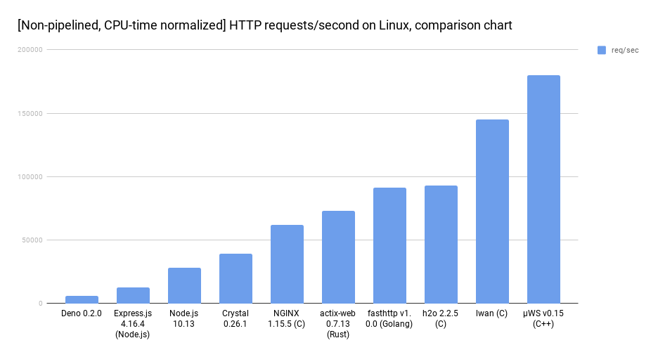
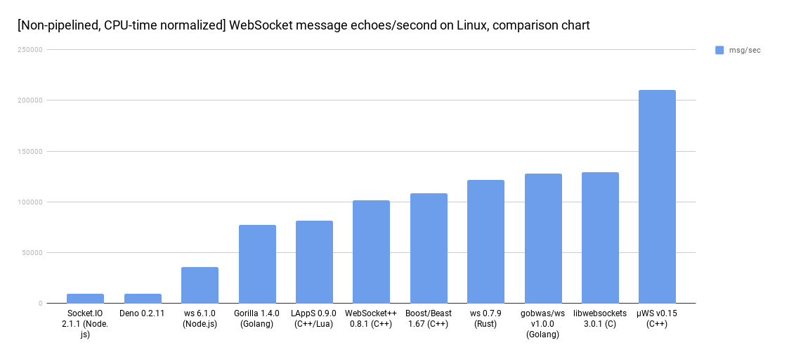

# Benchmark-driven development

Making decisions based on scientific benchmarking **while** you develop can guide you to create very efficient solutions if you have the dicipline to follow through. µWebSockets performs with **98%** the theoretical maximum for any user space Linux process - if anything would ever be faster, it would only be so by less than 2%. We know of no such project.

Http | WebSockets
--- | ---
 | 

Because of the big lead in cleartext performance, it's actually possible to enable TLS 1.3 encryption in µWebSockets and still beat most of the competition in an unfair cleartext-vs-encrypted run. Performance retention of TLS 1.3 encryption with µWebSockets is about 60%, so you do the math.

All of this is possible thanks to extensive benchmarking of many discarded prototypes & designs during development. The very first thing done in this project was to benchmark the Linux kernel against itself, to get a clear idea of expected maximum performance and thus a performance budget on this platform.

From that point every line of code was benchmarked against the budget and thrown away if it failed the vision. Today µWebSockets does WebSocket messaging without any significant overhead, making it very unlikely to ever be outperformed.

Of course, memory usage has always been a big factor in this. The name µWebSockets is meant to signify "small WebSockets" and comes from the memory optimizations made throughout. Holding many WebSockets should not require lots of RAM.

If you're looking for a performant solution, look no further.

## Common benchmarking mistakes
It is very common, extremely common in fact, that people try and benchmark µWebSockets using a scripted Node.js client such as autocannon, ws, or anything similar. It might seem like an okay method but it really isn't. µWebSockets is 12x faster than Node.js, so trying to stress µWebSockets using Node.js is almost impossible. Maybe if you have a 16-core CPU and dedicate 15 cores to Node.js and 1 core to µWebSockets.

So whatever you do, it is of greatest importance that you actually **do check and make sure that µWebSockets is being stressed to 100% CPU-time** before noting the result. If it isn't, then you're not really benchmarking µWebSockets - you're benchmarking your client, trying to stress µWebSockets! Please don't make this mistake.

## Why "hello world" benchmarking?

Contrary to popular belief, "hello world benchmarks" are the most accurate and realistic gauges of performance for the kind of applications µWebSockets is designed for:

* IO-gaming (latency)
* Signalling (memory overhead)
* Trading (latency)
* Finance (latency)
* Chatting (memory overhead)
* Notifications (memory overhead)

Most business applications of the above mentioned categories are implemented without a central on-disk DB, blocking or severely limiting hot-path performance. As such, web IO becomes a significant part of overall bottleneck, if not the only bottleneck.

Of course, if you build an app that *absolutely must* have an on-disk SQL DB central to all hot-paths, then µWebSockets is not the right tool for your app. Keep in mind that, finding a case where µWebSockets makes no difference, does not mean µWebSockets never makes a difference.
